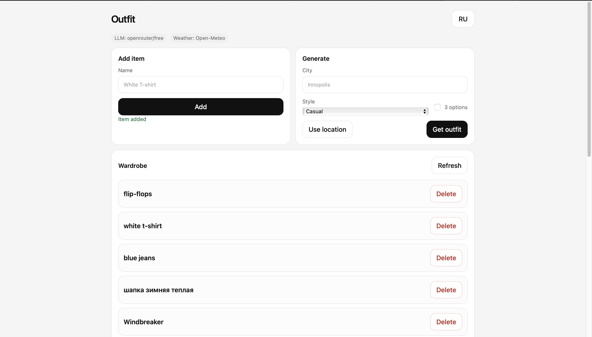
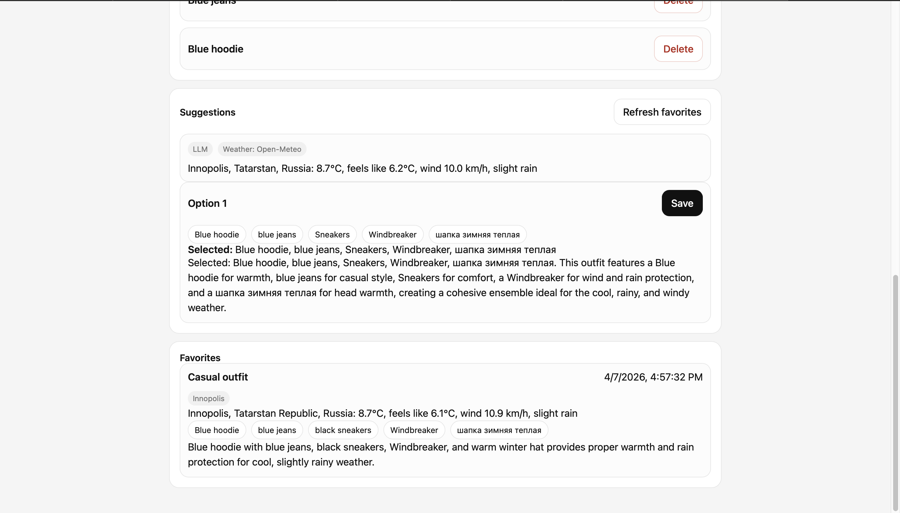

# Outfit Picker

A web app that helps choose what to wear using your wardrobe and the current weather.

## Demo




## Product context

### End users

Students and anyone who wants to decide what to wear faster.

### Problem

People waste time choosing clothes and still dress badly for the weather.

### Solution

The app stores wardrobe items, gets current weather, and suggests a practical outfit.

## Features

### Implemented

- Add wardrobe items
- Auto-detect category from item name
- View wardrobe items
- Delete wardrobe items
- Generate one outfit
- Generate three outfit options
- Casual, sporty, and minimal styles
- Save favorite outfits
- Browser geolocation
- Russian and English UI switch
- Optional OpenRouter LLM ranking and explanation
- Dockerized deployment

### Not yet implemented(future possible updates)

- User authentication
- Image upload
- Outfit history
- Better profile settings

## Version 1

- Add clothes
- View wardrobe
- Generate one outfit

## Version 2

- Multiple options
- Style preferences
- Favorites
- Auto weather detection
- Language switch
- Optional OpenRouter mode

## Usage

1. Open the app.
2. Add clothes by name.
3. Enter a city or use geolocation.
4. Choose a style.
5. Click `Get outfit`.
6. Save a favorite if needed.

## Deployment
Open http://localhost:8000

### Target OS

- Ubuntu 24.04

### Required software

- Git
- Docker
- Docker Compose plugin

### Step-by-step deployment

```bash
git clone https://github.com/Russian-Tsar-Nikolay-II/se-toolkit-hackathon
cd se-toolkit-hackathon
cp .env.example .env
nano .env
sudo docker compose up --build -d
```

## Local run

```bash
python3 -m venv .venv
./.venv/bin/python3 -m pip install -r requirements.txt
./.venv/bin/python3 -m uvicorn app.main:app --reload --host 0.0.0.0 --port 8000
```

## OpenRouter setup

Create `.env` in the project root:

```env
LLM_API_KEY=YOUR_OPENROUTER_API_KEY
LLM_BASE_URL=https://openrouter.ai/api/v1
LLM_MODEL=openrouter/free
```

If `.env` is missing, the app still works in rule-based mode.

## Docker run

```bash
docker compose up --build
```
